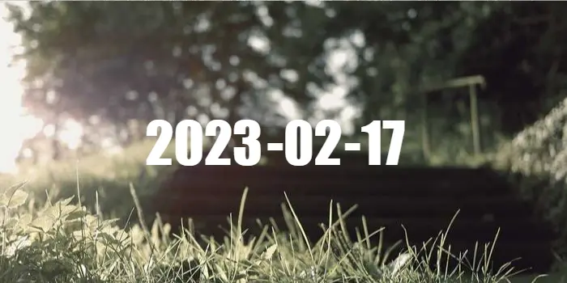

- [웹 포트폴리오](#웹-포트폴리오)
  - [바로 채용되는 웹개발자 포트폴리오 만들기](#바로-채용되는-웹개발자-포트폴리오-만들기)
  - [다른 사람의 포트폴리오 구경하기](#다른-사람의-포트폴리오-구경하기)
    - [Top 25 Portfolio Inspirations for Web Developers](#top-25-portfolio-inspirations-for-web-developers)

 

# 웹 포트폴리오

이력서나 자기소개서는 내가 할 수 있는 최선을 다해 작성하고 헤드헌터나 다른 개발자들에게 피드백을 받아보니, 문제없고 잘 작성했다는 말만 돌아왔다. 하지만 지원하는 회사마다 번번이 떨어졌다.
  
스스로 단점을 짚어보자면, 짧은 경력과 잦은 이직, 포트폴리오 프로젝트가 아쉽다는 것이다.
  
짧은 경력으로 인해 결국은 신입인데, 보여줄 수 있는 포트폴리오 프로젝트는 예전에 웹 개발 학원 당시 2주간 진행했던 Node.js express 기반 개인 프로젝트 커뮤니티 사이트가 전부였다.  
  
'보기 좋은 떡이 먹기도 좋다', 면접관들의 눈길을 끌려면 일단 멋지고, 매력적이어야 한다.  
  
그래서 최근에 '어떤 프로젝트를 만들까? 어떤 것이 나의 흥미를 자극할 수 있을까?'라는 고민하고 있던 찰나에 유튜브에서 내 눈에 딱 들어온 영상이 있었다.

## 바로 채용되는 웹개발자 포트폴리오 만들기

  <a href='https://www.youtube.com/watch?v=yDhMmmHZONM'>
    
    
코딩애플 - 바로 채용되는 웹개발자 포트폴리오 만들기

  </a>

 

매번 생각해낸 새로운 프로젝트의 아이디어는 고리타분하고 누군가 이미 만들어 놓은 것들 투성이라 흥미가 생기지 않았다. 이 영상이 나의 시야를 더욱 넓혀주었다.

## 다른 사람의 포트폴리오 구경하기

구글에 'web frontend portfolio'라고 검색하면 많은 사이트들이 나온다. 첫 번째에는 따끈한 2023년 2월 7일에 작성된 글이 눈에 띄었다.

### [Top 25 Portfolio Inspirations for Web Developers](https://www.hostinger.com/tutorials/web-developer-portfolio)

역동적인 사이트들이 많은 것 같다. 사이트 들어가면 다른 프로젝트도 소개하고있다.

개인적으로 좀 신기하고 흥미로운 사이트는 [Bruno Simon](https://bruno-simon.com/ "Bruno Simon")였다.

정말 재치있고 기발하다. ㅎㅎ 나에겐 미니카가 너무 빨라서 제어하기 좀 난감하긴했다~  이 사람의 깃허브를 들어가보니팔로우 숫자가 14.2k... 유명하신분이었군요!!

미니카를 기준으로 멀리있는 오브젝트는 블러 처리로 흐릿하게 보이는 디테일적인 요소에서 감동까지 느껴지기도 한다.

   

이미지 캡처로는 흐릿한 부분이 티가 잘 안나는데 브라우저로 보면 확연히 느껴진다.
