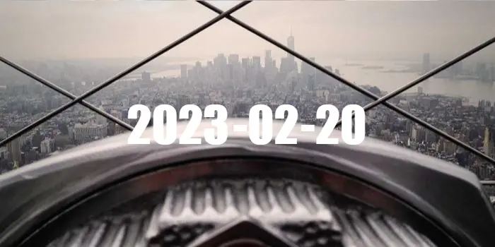

- [\<dialog\>](#dialog)
  - [나도 한번 해보자](#나도-한번-해보자)
    - [소스 코드](#소스-코드)
    - [결과물](#결과물)

</br>

# \<dialog\>

매번 쓰던 태그만 썼고 전체적인 HTML 태그가 무엇들이 있는지 자세히 살펴보지는 않았었다. 그래서 이번에 노마드 코더의 영상을 통해 dialog 태그에 대해 알게되었다.

<div align='center'>
  <a href='https://www.youtube.com/watch?v=cNfpkKUYAyo'>
     
     <p>노마드 코더 - HTML로 코딩하기</p>
  </a>
</div>
</br>

dialog 태그를 모르고 있어서 modal 라이브러리를 많이 사용했었는데, 최적화나 CEO를 위해서는 최대한 웹 표준에 맞는 태그 사용하는 것이 좋지 않을까라는 생각이 든다.

[MDN](https://developer.mozilla.org/ko/docs/Web/HTML/Element/dialog)에서 확인해본 결과 현재 모든 브라우저에서 지원해주고 있음을 확인했다.

<div align='center'>
   
</div>

HTML 업데이트 내용은 아래 링크를 통해서 확인할 수 있다.
<https://html.spec.whatwg.org/multipage/interactive-elements.html#the-dialog-element>

## 나도 한번 해보자

### 소스 코드

```html
<!-- 2022-02-21(화) <dialog> 이해하기 with tailwindCSS -->
<!DOCTYPE html>
<html lang="kr">

<head>
  <meta charset="UTF-8">
  <meta http-equiv="X-UA-Compatible" content="IE=edge">
  <meta name="viewport" content="width=device-width, initial-scale=1.0">
  <title>Dialog Element</title>
  <script src="https://cdn.tailwindcss.com?plugins=typography"></script>
  <!-- tailwindcss 사용시 타입이 text/css이 아닌 text/tailwindcss로 설정해야한다. -->
  <style type="text/tailwindcss">
    @tailwind base;
    @tailwind components;
    @tailwind utilities;
    @tailwind variants;

    body {
      @apply w-screen h-screen;
    }
    main {
      height: 70%;
      @apply flex text-gray-500;
    }
    dialog {
      @apply border-solid border-2 rounded-lg border-blue-400;
    }
    dialog::backdrop {
      background-color: rgba(0, 0, 0, 0.2);
      /* backdrop의 필터 속성은 filter가 아닌 backdrop-filter를 사용해야한다. */
      backdrop-filter: blur(1px);
    }
    .modal-btn {
      @apply border-solid border-2 rounded-lg p-2 mt-2 border-sky-300 hover:bg-sky-300
    }
  </style>
</head>

<body>

  <main>
    <button class="show-btn block w-40 h-10 m-auto 
      border-solid border-2 rounded-lg border-lime-400 
      hover:bg-lime-400">Show Modal</button>
  </main>

  <dialog id="dialog-1">
    <p class="prose">구독에 동의하십니까?</p>
    <form method="dialog" class="flex justify-between">
      <button value="cancel" class="modal-btn">취소</button>
      <button value="confirm" class="modal-btn">확인</button>
    </form>
  </dialog>

  <dialog id="dialog-2" class="w-120 h-36">
    <div class="flex items-center h-full">
      <p>구독이 완료되었습니다.</p>
    </div>
  </dialog>

</body>

<script>
  const showBtn = document.querySelector('.show-btn');
  /** @type {HTMLDialogElement} */
  const dialogOne = document.querySelector('#dialog-1');
  /** @type {HTMLDialogElement} */
  const dialogTwo = document.querySelector('#dialog-2');

  showBtn.addEventListener('click', () => {
    dialogOne.showModal();
  })

  dialogOne.addEventListener('close', (event) => {
    // event.returnValue는 close이벤트에 대한 리턴 값으로 true를 반환한다.
    if (dialogOne.returnValue === 'confirm') {
      dialogTwo.showModal();
    }
  })

  // backdrop 클릭시 닫히는 이벤트 함수
  dialogTwo.addEventListener('click', function (event) {
    /**
      * target === this 조건으로 close를 한다면 dialog 상자 안에 빈 곳을 클릭해도 닫힌다.(this 바인딩에 주의)
      * 정확하게 dialog 바깥인 backdrop 클릭시에만 이벤트를 호출하려면 클릭 포인트가 
      * 상자 내부에 있는지를 체크하기 위해 left right top bottom을 확인해야한다.
      */
    /** @type {HTMLDialogElement} */
    const target = event.target;
    const rect = target.getBoundingClientRect();
    if (rect.left > event.clientX ||
      rect.right < event.clientX ||
      rect.top > event.clientY ||
      rect.bottom < event.clientY
    ) {
      dialogTwo.close();
    }
  })
</script>

</html>
```

### 결과물

<div align='center'>
   
</div>

뭔가 그냥 하기에는 심심하고 욕심이나서 tailwindcss도 적용하면서 @apply도 익히고, outside click 이벤트로 모달을 닫히게 하는 것도 해보았다. 블러도 잘 먹는 것 보니 다음에도 써볼만 한 것 같은데??
