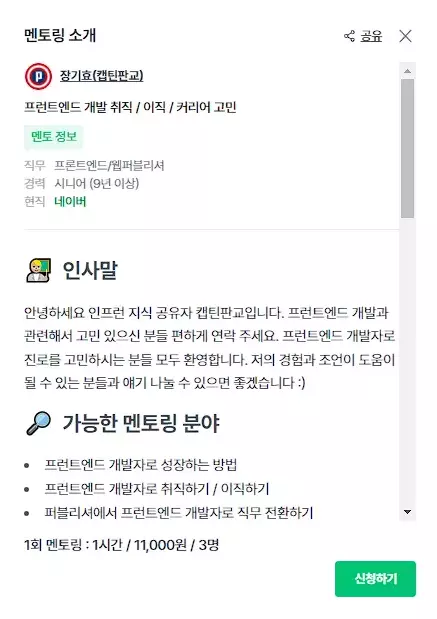

# 2023-02-25

- [2023-02-25](#2023-02-25)
  - [장기효(캡틴판교)님의 멘토링](#장기효캡틴판교님의-멘토링)
    - [질문과 답변](#질문과-답변)
      - [프론트엔드 학습 방향이 어떻게 되나요?](#프론트엔드-학습-방향이-어떻게-되나요)
      - [개발자 나이가 많아도 괜찮나요?](#개발자-나이가-많아도-괜찮나요)
      - [개인 프로젝트로 클론코딩은 어떨까요?](#개인-프로젝트로-클론코딩은-어떨까요)
      - [개인 프로젝트 아이디어는 어떻게 찾을까요?](#개인-프로젝트-아이디어는-어떻게-찾을까요)
      - [경력이 짧아서 신입처럼 보는데 연봉을 낮춰서라도 들어가야할까요?](#경력이-짧아서-신입처럼-보는데-연봉을-낮춰서라도-들어가야할까요)
      - [블로그에 대한 피드백으로, 개념을 정리한 내용은 검색하면 다 나오니까 경험이나 문제해결 위주로 작성이 중요하다고 하는데 그게 맞을까요?](#블로그에-대한-피드백으로-개념을-정리한-내용은-검색하면-다-나오니까-경험이나-문제해결-위주로-작성이-중요하다고-하는데-그게-맞을까요)
      - [글쓰기의 중요성](#글쓰기의-중요성)
    - [멘토링 받은 후기](#멘토링-받은-후기)
      - [앞으로 해야할 것들](#앞으로-해야할-것들)
      - [끝으로](#끝으로)

## 장기효(캡틴판교)님의 멘토링

인프런에 멘토링 플랫폼이 있어서 살펴보던 중 예전부터 익숙한 '캡틴판교'라는 닉네임이 눈에 띄었다.

   
   
출처: <a>https://www.inflearn.com/mentors?mentor_id=66</a>

멘토링 날짜가 1~2주 늦춰질 뻔 했지만, 다행히 장기효님의 배려로 처음 예약된 날짜에서 1시간 일찍 zoom에서 만나는 것으로 결정이 되었다.

웹 프론트엔드 개발자가 되기 위해 학원을 다니고 있는 사람, 이직에 고민이 있는 나, 장기효님까지 총 3명의 랜선 만남이 이루어졌다.

### 질문과 답변

#### 프론트엔드 학습 방향이 어떻게 되나요?

- HTML, CSS, Javascript, 비동기
- 웹 라이브러리, 프레임워크
- 개인 프로젝트
  - 로그인, 로그아웃
  - 회원가입
  - CRUD

> '캡틴판교의 프론트엔드 개발 학습 방법' 영상도 도움이 될 것 같다.
> <https://www.youtube.com/watch?v=IXtfqhBIQos>

#### 개발자 나이가 많아도 괜찮나요?

포트폴리오, 프로젝트 경험이 중요하기 때문에 나이는 큰 상관이 없습니다.

> 내 주변에도 35살에 신입으로 들어가신분들도 있다. 나이가 큰 장애물은 아니라고 본다. 다만 공백이 많은 경우는 공백에 대하여 많이 물어볼 것이다. 어찌 되었든 실력이 가장 중요하단 것, 그리고 그 실력을 어떻게 어필하느냐도 중요한 것 같다.

#### 개인 프로젝트로 클론코딩은 어떨까요?

클론 코딩이라고 해도 계속해서 기능을 추가하고 개선해 나가는 것 또한 좋습니다. 멘티분 중에도 강의를 통해 클론 코딩한 것을 가지고 기능을 추가하고 개선하면서 좋은 곳에 취직한 사례가 있습니다.

그리고 클론 코딩 같은 경우에는 레이아웃 배치나 스타일은 이미 완성된 것이 있기 때문에 이 부분에는 평가가 불가능하고, 기능에 대해서만 평가할 수 있습니다.

어떻게 시작하든, 하나의 프로젝트를 꾸준히 기능을 추가하고 개선해 나가는 것이 중요합니다.

> 경력이 있으니 클론 코딩 말고, 직접 기획부터 디자인까지 해보는 것을 추천해주셨다. 그런데 나에게는 아이디어에 대한 고민이 많았다.

#### 개인 프로젝트 아이디어는 어떻게 찾을까요?

다른 사람의 토이 프로젝트를 참고하거나, 일상생활에서 불편함을 느끼는 것들을 서비스로 만들어보면 좋을 것 같습니다. 그리고 이슈되고 있는 chatGPT API를 활용해서 만들 수 있는 것이 다양하니까, 이슈가 되고 있는 이 시기에 맞춰 만들어보는 것도 좋습니다.

> chatGPT로 연애상담을 만들까 안그래도 생각하고 있었는데, 진짜 그거로 갈까??

#### 경력이 짧아서 신입처럼 보는데 연봉을 낮춰서라도 들어가야할까요?

보내주신 이력서를 보니 정말 좋은 스펙을 가진 것 같아요. 연봉 절대 낮춰서 들어가지 마세요. 이력은 좋은데 어필이 조금 더 되었으면 좋겠어요.

그래서 블로그에 글을 쓰거나 깃허브에 기록하는 것이 중요합니다.
블로그는 글이 많은 것 보다, 하나라도 내용의 양과 질이 중요합니다.

> 게임개발 경력 9개월, 웹은 5개월, 3개월이다. 웹 개발자로 지원하면, 게임 개발에 대한 경력은 전혀 인정받지 못한다. 나의 어필이 부족했다고 생각한다.

#### 블로그에 대한 피드백으로, 개념을 정리한 내용은 검색하면 다 나오니까 경험이나 문제해결 위주로 작성이 중요하다고 하는데 그게 맞을까요?

개념을 정리하는 글도 좋습니다. 꼭 경험이나 문제해결에 대한 내용을 다루지 않아도 괜찮아요. 다만, 내용의 양과 질이 중요합니다. 그리고 사람마다 보는 관점이 다르니까요 :)

> tistory 블로그에서 '나의개발일지'라는 카테고리에 지금 쓰고 있는 TIL을 작성했었는데, 그것보다는 깃허브에 TIL 저장소를 만들어 기록하는 것이 나을 것이라고 조언해주셔서 옮겼다.

#### 글쓰기의 중요성

회사 업무에서 다양한 분야의 사람과 협업을 하게되는데, 전공자가 아닌 상대방에게 이해할 수 있도록 쉽게 설명해야하는데, 그런 능력을 키우기에는 블로그 글쓰기가 좋습니다.

 

### 멘토링 받은 후기

나의 가장 큰 고민은 '이직시 연봉을 낮춰서라도 들어가야하나?'에 대한 것이었는데, 자신감이 생긴 것 같다.

나에게 가장 준비가 덜 된 것은 좋은 이력이 있음에도 그것을 어딘가에 증명할 수 있는 자료가 하나도 없었다는 것이다. 포트폴리오에 포함되어 있어야하는 것인데, 그런것들이 없이 이력만 써놓아서 이력서를 읽어보는 사람의 입장에서는 '짧은 기간에 이것저것 많이 경험한 것 같은데 뭘 어떻게 했다는거지?'라는 의문이 들 것 같다.

#### 앞으로 해야할 것들

- 블로그 글쓰기를 좀 더 신경쓸 것!
- 경력을 이력서에만 적을 것이 아니라 블로그든 깃허브든 표현하자!
- 개인 프로젝트를 진행하자!

#### 끝으로

장기효 멘토님 덕분에 용기를 얻어갈 수 있었습니다. 감사합니다^^
