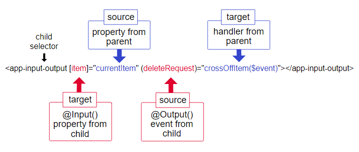

# 2023-03-09 (목)

- [Angular 기초 학습](#angular-기초-학습)
  - [Angular 기본 사용법](#angular-기본-사용법)
  - [Angular 자식 컴포넌트로 데이터 전달하기](#angular-자식-컴포넌트로-데이터-전달하기)
  - [Angular 부모 컴포넌트로 데이터 전달하기](#angular-부모-컴포넌트로-데이터-전달하기)

## Angular 기초 학습

### Angular 기본 사용법

- html 요소에 [*ngIf](https://angular.kr/api/common/NgIf)를 사용하여 조건문을 작성할 수 있고, 참일 때 렌더링된다.
`<p *ngIf="product && product.price > 700"> </p>`
- html 요소에 [*ngFor](https://angular.kr/api/common/NgFor)을 사용하여 반복문인 forEach 방식으로 사용할 수 있다.
`<div *ngFor="let product of products"> </div>`
- html 요소 내용을 {{ }}으로 자바스크립트 변수 값을 표현할 수 있다.
`<p>Description: {{ product.description }}</p>`
- html 요소에 []는 프로퍼티 바인딩으로 프로퍼티 값을 템플릿 표현식으로 활용할  수 있다.
`<a [title]="product.name + ' details'">{{ product.name }}</a>`
- html 요소에 ()는 컴포넌트에 정의된 함수를 이벤트 핸들러로 지정할 수 있다.
`<button (click)="share()">Share</button>`

### Angular 자식 컴포넌트로 데이터 전달하기

<https://angular.kr/guide/inputs-outputs#%EB%B6%80%EB%AA%A8-%EC%BB%B4%ED%8F%AC%EB%84%8C%ED%8A%B8%EB%A1%9C-%EB%8D%B0%EC%9D%B4%ED%84%B0-%EC%A0%84%EB%8B%AC%ED%95%98%EA%B8%B0>

자식 컴포넌트 ts 파일에 @Component() 데코레이터의 selector 속성은 태그로 사용가능하다. @angular/core 모듈에서 @Input() 데코레이터를 이용하여 부모로부터 데이터를 받아올 수 있다. 부모 컴포넌트 html에서 자식 컴포넌트의 selector의 프로퍼티 바인딩을 통해 데이터를 받는다.

```jsx
// 자식 컴포넌트 ts 파일
import { Component, Input } from '@angular/core';
import { Product } from '../products';

@Component({
  selector: 'app-product-alerts',
  templateUrl: './product-alerts.component.html',
  styleUrls: ['./product-alerts.component.css'],
})
export class ProductAlertsComponent {
 @Input() product: Product | undefined;
}
```

```html
<!-- 부모 컴포넌트 html 파일 -->
<div *ngFor="let product of products">
 <app-product-alerts [product]="product"></app-product-alerts>
</div>
```

### Angular 부모 컴포넌트로 데이터 전달하기

<https://angular.kr/guide/inputs-outputs#%EB%B6%80%EB%AA%A8-%EC%BB%B4%ED%8F%AC%EB%84%8C%ED%8A%B8%EB%A1%9C-%EB%8D%B0%EC%9D%B4%ED%84%B0-%EC%A0%84%EB%8B%AC%ED%95%98%EA%B8%B0>

@angular/core 모듈에서 @Output() 데코레이터와 EventEmitter 인터페이스를 이용하여 부모에게 데이터를 전달할 수 있다. EventEmitter의 emit 함수를 통해 데이터를 전달할 수 있고, 부모의 html에서 @Output() 데코레이터로 정의된 함수를 이벤트로 핸들링하여 사용한다. 그리고 $event 키워드로 자식 컴포넌트에서 emit을 통해 전달한 데이터를 사용할 수 있다.

```jsx
// 자식 컴포넌트 ts 파일
import { Component, Output, EventEmitter } from '@angular/core';

@Component({
  selector: 'app-product-alerts',
  templateUrl: './product-alerts.component.html',
  styleUrls: ['./product-alerts.component.css'],
})
export class ProductAlertsComponent {
  @Output() notifyStringEvent = new EventEmitter<string>();

  notifyString(value: string) {
    this.notifyStringEvent.emit(value);
  }
}

// 부모 컴포넌트 ts 파일 클래스 내부
notifyShow(message: string) {
    window.alert(message);
}
```

```html
<!-- 자식 컴포넌트 html 파일 -->
<p *ngIf="product">
  <button type="button" (click)="notifyString('hello')">Notify Me</button>
</p>

<!-- 부모 컴포넌트 html 파일 
@Output으로 정의된 이벤트를 사용한다. $event로 자식의 데이터를 전달 받는다. -->
<app-product-alerts (notifyStringEvent)="notifyShow($event)"></app-product-alerts>
```


